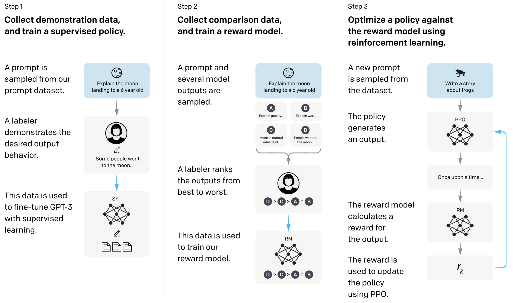
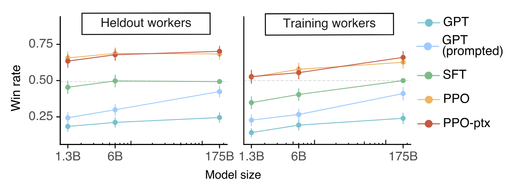
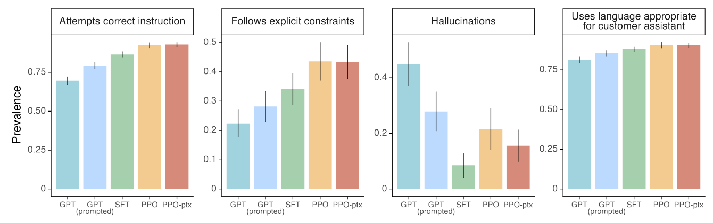
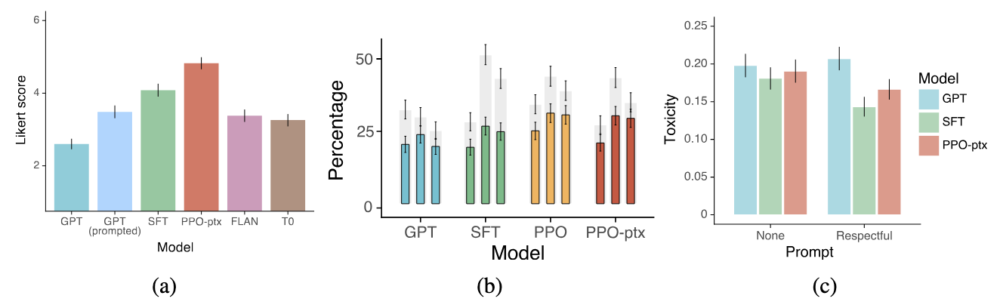

# Training Language Models to Follow Instructions with Human Feedback

- **논문:** Long Ouyang et al., NeurIPS 2022
- **원문:** [NeurIPS 논문 PDF](https://proceedings.neurips.cc/paper_files/paper/2022/file/b1efde53be364a73914f58805a001731-Paper-Conference.pdf)
- **범위:** 연구 동기와 학습 방법. 실험 결과는 다루지 않음.

## 1. 연구 동기

GPT-3 같은 pre-trained Language Model은 텍스트의 다음 토큰을 예측하도록 학습한다 (Next Token Prediction). 이를 loss function 수식으로 쓰면 다음과 같다.

$$
\begin{aligned}
\mathcal{L}_{\mathrm{pretrain}}(\theta)
&=
-\mathbb{E}_{x\sim\mathcal{D}_{\mathrm{pretrain}}}
\left[\sum_t \log p_\theta(x_t\mid x_{<t})\right].
\end{aligned}
$$

그러나 사용자는 다음 토큰을 그럴듯하게 이어 쓰는 것보다 지시(instruction)를 따르고, 던지는 질문에 유용하고 정확하게 답하며, 사실을 꾸며내지 않기를 기대한다. **사전학습 목표와 사용자가 원하는 행동 사이의 차이 (misaligned)**가 이 논문의 출발점이다.

- pre-training : next token prediction
- user intention : follow the user’s instructions helpfully and safely

따라서 이 논문에서는 language model을 fine-tuning하여, 사전학습 목표(pre-training)와 실제로 사용자가 원하는 행동(user intention) 간의 차이를 좁히는 aligning을 한다.

이를 위해 **Reinforcement Learning from Human Feedback (RLHF)** 기법을 사용하며, 사람의 시범 답변과 선호도(preference) 판단을 통해 pre-trained GPT-3를 fine-tuning한다.

저자들은 그렇게 얻은 모델을 **InstructGPT**라고 부른다.

## 2. 전체 학습 흐름

*그림: 원문 Figure 2. 사람의 시범 답변으로 정책을 초기화하고 (Stage 1), 답변 순위로 보상 모델을 학습한 뒤 (Stage 2), 그 보상을 이용해 정책을 갱신한다 (Stage 3).*

| 단계 | 입력 데이터 | 학습 대상 | 역할 |
| :--- | :--- | :--- | :--- |
| Stage 1. SFT | 프롬프트와 사람이 작성한 답변 (labeler demonstrations) | SFT Policy | 지시를 따르는 초기 답변 방식 학습 |
| Stage 2. RM | 프롬프트와 여러 답변의 선호 순위 | Reward Model | 사람이 선호할 답변에 높은 점수 부여 |
| Stage 3. Reinforcement Learning | 별도의 프롬프트와 보상 모델의 점수 | Policy | 보상을 높이면서 SFT 정책에서 과도하게 벗어나지 않도록 학습 |

학습 prompt, 즉 학습 데이터셋은 **Stage 1 - SFT 약 1.3만 개**, **Stage 2 - RM 약 3.3만 개**, **Stage 3 - Reinforcement Learning 약 3.1만 개**다. PPO용 prompt에는 사람이 작성한 정답이나 선호도 라벨이 붙어 있지 않다.

---

### Step1. SFT: 사람의 시범 답변 모방

Human labeler가 prompt $x$에 대해 바람직한 답변 $y_{\mathrm{demo}}$를 직접 작성한다. 이 데이터로 pre-trained GPT-3를 Supervised Fine-Tuning (SFT)하여 초기 policy $\pi_{\mathrm{SFT}}$를 만든다.

$$
\begin{aligned}
\mathcal{L}_{\mathrm{SFT}}
&=
-\mathbb{E}_{(x,y_{\mathrm{demo}})\sim\mathcal{D}_{\mathrm{SFT}}}
\left[\log \pi_{\mathrm{SFT}}(y_{\mathrm{demo}}\mid x)\right].
\end{aligned}
$$

Prompt는 주로 API에서 수집했고, 일부는 labeler가 작성했다.

SFT의 역할은 $\pi_{\mathrm{pretrained}}$ $\rightarrow$ $\pi_{\mathrm{SFT}}$ 를 만들어 reasonable instruction-following policy로 초기화하는 것이다. 즉, 최소한 사람이 원하는 답변과 비슷한 영역까지 policy를 먼저 준비해두는 것이다.

#### 예시
1. SFT prompt 약 1.3만 개에 대해서, 다음과 같은 과정을 반복하며 정답을 생성
- Prompt: "Explain the moon landing to a 6 year old."
- Human labeler output: "Some people went to the moon ..."

2. 이렇게 수집된 SFT dataset pair (x, $y_{\mathrm{demo}}$)에 대하여 pre-trained GPT-3 모델을 Supervised Fine-Tuning (SFT)
- $\pi_{\mathrm{pretrained}}$ $\rightarrow$ $\pi_{\mathrm{SFT}}$

---

### Step2. RM: 답변 간 선호도 학습

하나의 prompt에 대해 $\pi_{\mathrm{SFT}}$ 로 답변 $K$개를 생성하고, labeler가 $K$개 답변 사이의 선호도 순위를 매긴다 (논문에서 $K$는 4~9). 학습 데이터의 답변은 주로 SFT policy에서 생성되고, 일부는 PPO 정책에서도 생성되었다.

동률이 없는 완전한 순위라면 한 프롬프트에서 얻을 수 있는 서로 다른 답변 쌍은 다음과 같다.

$$
\binom{K}{2}=\frac{K(K-1)}{2}.
$$

예를 들어 $y_3 \succ y_1 \succ y_4 \succ y_2$라는 순위는 여섯 개의 선호 쌍으로 바뀐다. 동률인 쌍은 학습에서 제외한다.

Reward Model $r_\theta(x,y) \in \mathbb{R}$는 프롬프트와 답변을 받아 **Scalar Score**를 출력한다. 구조적으로는 GPT 계열 LM에서 최종 output layer를 scalar projection으로 교체한 형태이다. 즉, 

$$
Prompt y + Response y \rightarrow Reward Model \rightarrow reward (scalar)
$$

좋은 respons에는 높은 reward를, 나쁜 response에는 낮은 reward를 주도록 학습한다.

선호 쌍에서 $y_w$가 $y_l$보다 낫다고 판단될 확률은 다음처럼 모델링한다.

$$
\begin{aligned}
P_\theta(y_w\succ y_l\mid x)
&=
\sigma\!\left(r_\theta(x,y_w)-r_\theta(x,y_l)\right),
\end{aligned}
$$

한 프롬프트에서 모든 쌍을 얻었다면 보상 모델의 손실을 다음처럼 나타낼 수 있다.

$$
\begin{aligned}
\mathcal{L}_{\mathrm{RM}}(\theta)
&=
-\frac{1}{\binom{K}{2}}
\sum_{(y_w,y_l)}
\log \sigma\!\left(r_\theta(x,y_w)-r_\theta(x,y_l)\right).
\end{aligned}
$$

이를 학습 프롬프트 전체에 평균 낸다. 선호도 예측에는 보상의 절대값보다 **두 답변의 점수 차이 (difference)**가 중요하다. 논문에서는 6B Reward Model을 사용한다. 175B는 학습 안정성과 계산 비용 면에서 불리했다.

---

### Step3. Reinforcement Learning: 보상 모델을 이용한 정책 갱신

우리는 Step 1과 Step 2를 통해 각각 SFT policy와 Reward Model을 얻었다.

SFT policy를 initial policy로 삼는다. 새 prompt $x$에 대해 policy $\pi_\phi$가 response $y$를 생성하면, Reward Model이 $r_\theta(x,y)$를 계산한다. Reinforcement Learning에 사용되는 PPO는 이 reward을 높이도록 policy를 갱신한다.

Reward Model의 점수만 극대화하면 모델이 Reward Model의 허점을 이용하는 **Reward Hacking**이 발생할 수 있다. 이는 모델이 여러 가지 편법 혹은 의도하지 않은 방법을 통해 최종 목표만 달성하도록 학습되는 것을 말하며, 구체적으로 추론 중간 과정을 아무렇게나 수행한 뒤 최종 정답만 형식적으로 맞추도록 학습되는 경우가 해당된다. 이를 줄이기 위해 **fixed SFT policy**을 reference policy로 두고, 다음의 로그 확률비에 비례하는 페널티를 부과한다.

$$
\begin{aligned}
R(x,y)
&=
r_\theta(x,y) - \beta\log\frac{\pi_\phi(y\mid x)}{\pi_{\mathrm{SFT}}(y\mid x)}.
\end{aligned}
$$

논문 구현에서는 답변의 각 토큰에 이 페널티를 적용하며 $\beta=0.02$를 사용한다. 생성 답변에 대해 위 로그 확률비를 평균 내면 현재 정책과 SFT 정책 사이의 KL divergence가 된다. 따라서 **개별 답변에 부과하는 페널티는 로그 확률비**이고, **기댓값 수준에서 KL Regularization**으로 해석할 수 있다. PPO의 value function은 Reward Model에서 초기화한다.

### PPO-ptx와 alignment tax

선호도에 맞춘 fine-tuning은 pre-trained model이 가진 일부 일반 언어 능력에 성능 저하를 일으킬 수 있다. 논문은 이를 **Alignment Tax**의 한 형태로 다룬다.

이를 완화하기 위해 PPO 갱신에 사전학습 데이터의 log-likelihood를 높이는 gradient를 섞은 변형이 **PPO-ptx**다. 논문의 결합 목적함수는 다음과 같다.

$$
\begin{aligned}
J(\phi)
={}&
\mathbb{E}_{(x,y)\sim\mathcal{D}_{\pi_\phi}}
\left[
r_\theta(x,y)
-\beta\log
\frac{\pi_\phi(y\mid x)}
     {\pi_{\mathrm{SFT}}(y\mid x)}
\right] \\
&+
\gamma\,
\mathbb{E}_{z\sim\mathcal{D}_{\mathrm{pretrain}}}
\left[\log \pi_\phi(z)\right].
\end{aligned}
$$

1. Reward: +$r_\theta(x,y)$ $\quad$ $\rightarrow$ 사람의 선호에 맞게 행동

2. KL penalty: $-\beta {D}_{\mathrm{KL}}(\pi_\theta || \pi_\mathrm{SFT})$ $\quad$ $\rightarrow$ 기존 SFT behavior에서 너무 멀리 이탈하여 달라지지 않도록

3. Pretraining objective: $+\gamma \mathrm{log} \pi_\phi(x_\mathrm{pretrain})$ $\quad$ $\rightarrow$ pretrained model의 일반적인 language capability 유지

즉, 모델이 처음에 비해 크게 바뀌어서 원래 가진 일반 언어 능력을 너무 잃지 않도록 억제하는 것이다.

$\gamma=0$이면 사전학습 항을 섞지 않은 **PPO** 모델이고, $\gamma>0$이면 **PPO-ptx** 모델이다. 논문에서 별도 언급 없이 *InstructGPT*라고 할 때는 대체로 PPO-ptx 모델을 가리킨다. 위 식은 저자들이 제시한 **전체 학습 목표**이며, PPO의 clipped surrogate loss 자체를 적은 식은 아니다.

### 흐름을 이해하기 위한 가상 예시

다음은 논문에 나온 실험 사례가 아닌 설명용 예시다.

1. **SFT:** “양자역학을 열 살 어린이에게 설명해 줘”라는 프롬프트에 라벨러가 이해하기 쉬운 답변을 작성하고, 정책이 이를 모방한다.
2. **RM:** 모델이 같은 프롬프트에 여러 답변을 생성한다. 라벨러가 답변을 비교해 순위를 매기면 보상 모델은 선호되는 답변에 더 높은 점수를 주도록 학습한다.
3. **PPO:** 정책이 새 답변을 생성한다. 보상 모델 점수를 높이되 SFT 정책과 지나치게 다른 답변에는 로그 확률비 페널티를 적용하며 정책을 갱신한다.

**요약:** SFT는 바람직한 답변의 예를 보여 주고, RM은 답변을 비교할 기준을 학습하며, PPO는 그 기준을 이용해 정책을 개선한다. 이 기준은 라벨러와 연구자의 판단에 의존하므로 모든 사용자의 선호나 보편적 가치와 동일하다고 볼 수는 없다.

## 3. 실험 및 분석

### 3.1. Preference results of InstructGPT, measured by winrate against the 175B SFT model

- InstructGPT가 GPT-3보다 human preference에서 훨씬 선호된다. 심지어 1.3B InstructGPT가 175B GPT-3보다 더 선호된다.
- SFT만 하는 것보다 PPO를 추가하는 것이 더 좋다.
- Training labeler에만 overfit한 것이 아니라, held-out labeler에게도 선호된다.

### 3.2. Metadata results on the API distribution, averaged over model sizes

- InstructGPT가 instruction을 더 잘 따르고, explicit constraint를 더 잘 만족하며, hallucination도 줄어들었다.

### 3.3. Comparing InstructGPT with GPT-3 fine-tuned on the FLAN and T0 / Human evaluations on the TruthfulQA / Human evaluations on RealToxicityPrompts

- FLAN/T0 같은 public NLP instruction tuning보다 실제 API 사용 분포에서는 InstructGPT가 더 좋다.
